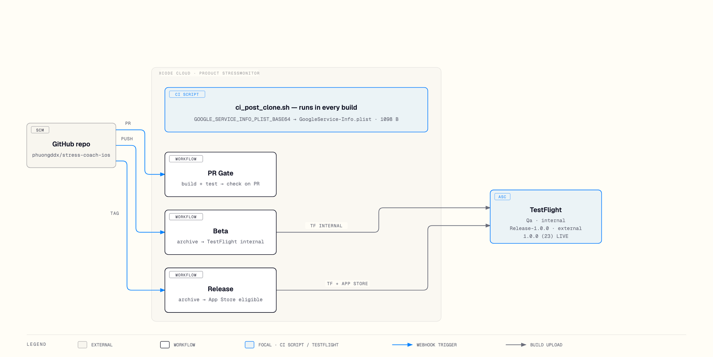

# StressMonitor

### Understand stress. Notice patterns. Take action.

StressMonitor is a privacy-first iPhone and Apple Watch app that turns HealthKit signals into a personal, explainable stress score. It combines on-device health analysis, long-term trends, guided recovery tools, and an AI coach in one SwiftUI experience.

[](https://developer.apple.com/ios/)
[](https://developer.apple.com/watchos/)
[](https://www.swift.org/)
[](docs/system-architecture.md)

> **Privacy by default.** Health data stays local-first. HealthKit access is read-only, CloudKit sync is optional, and raw HealthKit samples are never sent to the AI service — only the derived stress context travels with a chat message.

> **Status:** Live on TestFlight — every merge to `main` and every release tag produces a build automatically, and release 1.0.0 (23) is live on external group `Release-1.0.0` with beta review passed. App Store submission is pending. No CI badge is shown because Xcode Cloud has no public badge endpoint.

## Contents

- [Features](#features)
- [Screenshots](#screenshots)
- [How stress scoring works](#how-stress-scoring-works)
- [Architecture](#architecture)
- [How it ships](#how-it-ships)
- [Development](#development)
- [Repository map](#repository-map)
- [Technology](#technology)
- [Documentation](#documentation)

## Features

| Understand | Act | Stay connected |
|---|---|---|
| **Five-factor stress score** from HRV, heart rate, sleep, activity, and recovery | **Guided breathing** with animated pacing and before/after feedback | **Standalone Apple Watch app** with direct HealthKit access |
| **Personal baselines** adapt the model to individual physiology | **Mini Walk** offers a quick, timed reset | **Widgets and complications** surface the latest state at a glance |
| **Confidence and factor breakdowns** explain every result | **AI stress coach** streams contextual guidance through an authenticated API | **Optional CloudKit sync** keeps devices aligned offline-first |
| **History and trend analytics** reveal patterns over time | **Journal and habit check-ins** add context to measurements | **CSV and JSON export** preserves user ownership |

Additional product capabilities include morning readiness, biological-age insights, character progression, notifications, themes, StoreKit subscriptions and credit packs, and complete local/cloud data deletion.

## Screenshots

| Home | Trends | AI Coach |
|---|---|---|
|  |  |  |

| Breathing | Premium |
|---|---|
|  |  |

| Watch — live score | Watch — breathe | Watch — history |
|---|---|---|
|  |  |  |

## How stress scoring works

Each available signal is evaluated independently against the user's personal baseline. The calculator then redistributes the weights of missing factors, produces a score from 0–100, and reports both confidence and per-factor contributions.

```text
HealthKit
   │
   ├── HRV ────────────┐
   ├── Heart rate ─────┤
   ├── Sleep ──────────┼──> StressFactor contributors
   ├── Activity ───────┤         │
   └── Recovery ───────┘         v
                         MultiFactorStressCalculator
                                   │
                     weight redistribution + confidence
                                   │
                                   v
                    score (0–100) + factor breakdown
```

| Score | State | Meaning |
|---:|---|---|
| 0–25 | Relaxed | The body is showing low physiological strain |
| 26–50 | Mild | Some stress signals are elevated |
| 51–75 | Moderate | Recovery or regulation may be useful |
| 76–90 | High | Multiple signals indicate meaningful strain |
| 91–100 | Severe | Strong physiological stress signals are present |

Every state is dual-coded with color, icon, and text for accessibility.

## Architecture

StressMonitor uses MVVM with `@Observable` state, protocol-based dependency injection, Swift concurrency, and an offline-first data layer.

```text
┌────────────────────────────────────────────────────────────┐
│ SwiftUI                                                    │
│ Views · AppRouter · WidgetKit · watchOS                    │
└───────────────────────────┬────────────────────────────────┘
                            │ user intent / observable state
┌───────────────────────────▼────────────────────────────────┐
│ View models                                                │
│ Stress · Dashboard · Trends · Chat · Settings · Premium   │
└───────────────────────────┬────────────────────────────────┘
                            │ protocol-based dependencies
┌───────────────────────────▼────────────────────────────────┐
│ Domain services                                            │
│ Algorithm · HealthKit · AI/API · StoreKit · Sync · Export │
└───────────────┬──────────────────────────────┬─────────────┘
                │                              │
┌───────────────▼──────────────┐  ┌────────────▼─────────────┐
│ Local and Apple data         │  │ External boundaries      │
│ SwiftData · HealthKit        │  │ CloudKit · Stress API    │
│ App Groups · Keychain        │  │ Firebase Authentication  │
└──────────────────────────────┘  └──────────────────────────┘
```

### Core design decisions

- **Local-first persistence:** SwiftData is the primary store; CloudKit adds optional synchronization and conflict resolution.
- **Explainable calculation:** five small `StressFactor` implementations feed a single orchestrator instead of hiding logic in the UI.
- **Protocol boundaries:** HealthKit, persistence, CloudKit, StoreKit, and network services are replaceable at the ViewModel boundary.
- **Unidirectional flow:** views send intent to ViewModels; ViewModels coordinate services and publish state back to SwiftUI.
- **Platform-aware sharing:** the watch target mirrors the stress algorithm so it can calculate independently; App Groups and WatchConnectivity share presentation data.
- **Authenticated AI:** chat uses Firebase authentication and an SSE-streaming backend; only messages and derived stress context cross that boundary.

For a deeper walkthrough, see the [system architecture](docs/system-architecture.md) and the interactive [stress calculation diagram](docs/diagrams/stress-calculation-architecture.html).

## How it ships

Delivery runs on Xcode Cloud, with three workflows pinned to Xcode 26.6 on macOS Tahoe 26.6.2.



| Workflow | Trigger | Runs | Destination |
|---|---|---|---|
| **PR Gate** | Pull request targeting `main` | Build + `StressMonitorTests` | Merge gate only — nothing is distributed |
| **Beta** | Push to `main` | Archive → upload | TestFlight internal — group **Qa** |
| **Release** | Tag matching `release*` | App-Store-eligible archive → upload | TestFlight external — group **Release-1.0.0** |

Every cloud build provisions its Firebase configuration in `StressMonitor/ci_scripts/ci_post_clone.sh`: the `GOOGLE_SERVICE_INFO_PLIST_BASE64` secret is materialized into `GoogleService-Info.plist` right after checkout, and the build **fails closed** if the secret is missing — a partially configured build can never reach TestFlight. Signing is automatic under Apple Developer team `K2TYLYAWMK`. Group distribution rides on a TestFlight post-action, which is currently a one-click step per build.

GitHub Actions complements the cloud pipeline with a SwiftLint gate on pull requests ([ci.yml](.github/workflows/ci.yml)) and manual fastlane dispatches for distribution, release, and Match signing. The pipeline is proven end to end: the PR gate has run (#18), pushes to `main` produced Beta builds #20 and #22, and tagging `release/1.0.0` produced build #23 — the TestFlight external release 1.0.0 (23) now live, with beta review passed. An interactive version of the diagram is available at [xcode-cloud-pipeline.html](xcode-cloud-pipeline.html).

## Development

**Requirements:** macOS with Xcode 26.x and the iOS 18.6+ SDK (the app targets iOS 18.6; the watch app targets watchOS 11.6).

```sh
open StressMonitor/StressMonitor.xcodeproj
```

Select the **StressMonitor** scheme and press ⌘R. To run on a simulator or device without HealthKit history, add the `-demo-mode` launch argument (Product → Scheme → Edit Scheme → Run → Arguments) — the app then uses simulated HealthKit data end to end.

**Firebase configuration.** `GoogleService-Info.plist` is gitignored. It is required for AI chat and Firebase/Google Sign-In authentication, and not needed for stress scoring or demo mode. Ask a maintainer for a copy, or see the [deployment guide](docs/deployment-guide.md) for how Xcode Cloud injects it in the cloud.

**Lint.** SwiftLint enforces the project rules defined in `.swiftlint.yml`; every pull request is linted in CI.

**Tests.** The `StressMonitorTests` target ships with the `StressMonitor` scheme (⌘U to run) and executes in the Xcode Cloud PR gate on every pull request. The suite currently has known, pre-existing failures — a set of signal-trap crashes and tests that depend on real credentials — so do not expect a fully green run yet. See [Testing](docs/TESTING.md) for details.

## Repository map

```text
StressMonitor/
├── StressMonitor/                     # iOS application target
│   ├── Models/                        # SwiftData and domain models
│   ├── Services/                      # Algorithms and system integrations
│   │   ├── Algorithm/                 # Five-factor stress engine
│   │   ├── API/ and LLM/              # Authenticated chat and SSE streaming
│   │   ├── HealthKit/                 # Read-only health collection
│   │   ├── Repository/ and Sync/      # Local persistence and synchronization
│   │   └── StoreKit/                  # Subscriptions and credit packs
│   ├── ViewModels/                    # Observable application state
│   ├── Views/                         # SwiftUI feature modules
│   └── Theme/                         # Color, typography, and assets
├── StressMonitorWatch Watch App/      # Standalone watchOS target
├── StressMonitorWidget/               # Home and Lock Screen widgets
└── StressMonitorTests/                # Active application test target
```

The Xcode project lives at `StressMonitor/StressMonitor.xcodeproj`; similarly named folders at the repository root are legacy and are not part of the build.

## Technology

| Area | Implementation |
|---|---|
| Interface and state | SwiftUI, Observation (`@Observable`), Swift Charts |
| Health and calculation | HealthKit, five-factor personalized stress model |
| Persistence and sync | SwiftData, CloudKit, App Groups, WatchConnectivity |
| Companion experiences | watchOS, WidgetKit, ActivityKit |
| AI and identity | Native URLSession/SSE client, Firebase Auth, Google Sign-In |
| Commerce and security | StoreKit 2, Keychain Services |

Direct Swift Package dependencies are limited to Firebase Authentication and Google Sign-In.

## Documentation

- [Getting started](docs/GETTING-STARTED.md)
- [Documentation index](docs/INDEX.md)
- [Product overview (PDR)](docs/project-overview-pdr.md)
- [System architecture](docs/system-architecture.md)
- [Testing](docs/TESTING.md)
- [Configuration and signing](docs/CONFIGURATION.md)
- [Code standards](docs/code-standards.md)
- [Design guidelines](docs/design-guidelines.md)
- [Deployment guide](docs/deployment-guide.md)

---

Built by Phuong Doan.
